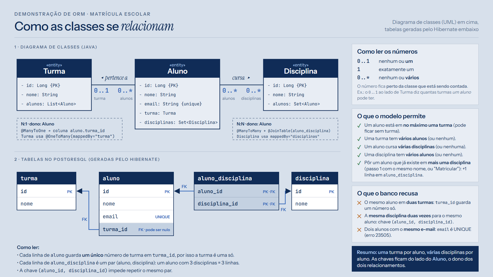

# Estudo de ORM: aproximando objetos e banco de dados

Estudo sobre **ORM (Object-Relational Mapping)** com duas partes:

1. **Apresentação** (PDF, 42 slides): o problema que o ORM resolve, entidades, mapeamento de atributos, relacionamentos, carregamento (LAZY × EAGER), o problema N+1, herança e quando usar ORM.
2. **Demonstração ao vivo** (aplicação Java): um sistema de **matrícula escolar** que mostra, em tempo real, o SQL que o Hibernate gera para cada ação feita na tela.

Tecnologias da demonstração: **Java 17**, **Hibernate 7.4** (Jakarta Persistence 3.2), **PostgreSQL 17** e **Swing**.

---

## Sumário

- [Estrutura do repositório](#estrutura-do-repositório)
- [Pré-requisitos](#pré-requisitos)
- [Executando pela primeira vez](#executando-pela-primeira-vez)
- [Os dados carregados a cada abertura](#os-dados-carregados-a-cada-abertura)
- [Usando a demonstração](#usando-a-demonstração)
- [Vendo as tabelas no pgAdmin](#vendo-as-tabelas-no-pgadmin)
- [O modelo de dados](#o-modelo-de-dados)
- [Como a aplicação mostra o SQL](#como-a-aplicação-mostra-o-sql)
- [Regenerando o PDF da apresentação](#regenerando-o-pdf-da-apresentação)
- [Problemas comuns](#problemas-comuns)

---

## Estrutura do repositório

```
estudo-orm/
├── ORM - aproximando objetos e banco de dados.pdf   ← a apresentação pronta
├── README.md                                          ← este arquivo
│
├── demo-matricula/                                    ← a aplicação de demonstração
│   ├── executar.bat          ← compila e abre (Windows)
│   ├── executar.sh           ← compila e abre (Linux/macOS)
│   ├── db.properties.exemplo ← modelo dos dados de conexão (o real é criado na 1ª execução)
│   ├── LEIA-ME.md            ← roteiro da demonstração para a apresentação
│   ├── lib/                  ← bibliotecas (.jar): Hibernate, driver PostgreSQL, H2
│   ├── docs/
│   │   └── diagrama-uml.pdf  ← diagrama de classes e tabelas (também em .png e .html)
│   └── src/                  ← código-fonte
│       ├── Principal.java              ← ponto de entrada (main)
│       ├── META-INF/persistence.xml    ← configuração do JPA/Hibernate
│       ├── modelo/                     ← as entidades: Aluno, Turma, Disciplina
│       ├── persistencia/               ← conexão, fábrica do JPA e captura do SQL
│       ├── negocio/Escola.java         ← os passos da demonstração e os dados iniciais
│       └── visao/                      ← a janela (Swing)
│
└── fonte-slides/                                      ← código-fonte da apresentação
    ├── src.html        ← os slides (HTML + CSS + diagramas em SVG)
    ├── gerar-pdf.py    ← gera o PDF a partir do src.html
    ├── slides.html     ← versão com as fontes embutidas (gerada pelo script)
    ├── fonts/          ← fontes usadas (Instrument Sans/Serif, JetBrains Mono)
    └── img/            ← prints da demonstração usados nos slides
```

**Por que as bibliotecas estão na pasta `lib/`?** Para ninguém precisar instalar Maven ou Gradle: basta ter o Java. O projeto compila com `javac` e as `.jar` dessa pasta, no mesmo estilo das atividades da disciplina.

---

## Pré-requisitos

| O quê | Para quê | Como conferir |
|---|---|---|
| **JDK 17 ou mais novo** (não só o JRE) | compilar e rodar a demonstração | `javac -version` no terminal |
| **PostgreSQL** (testado no 17) | o banco da demonstração | serviço `postgresql-x64-17` rodando |
| **pgAdmin 4** (vem com o PostgreSQL no Windows) | ver as tabelas durante a demonstração | opcional |
| **Python 3 + Google Chrome** | só para regenerar o PDF dos slides | opcional |

Você precisa saber a **senha do usuário `postgres`**, definida na instalação do PostgreSQL.

> Não precisa criar banco nem tabela: a aplicação cria o banco `escola_orm` na primeira execução, e o Hibernate cria as tabelas.

---

## Executando pela primeira vez

### 1. Baixar o projeto

```bash
git clone https://github.com/AlanyLourenco/estudo-orm.git
cd estudo-orm/demo-matricula
```

### 2. Abrir a demonstração

- **Windows:** dê dois cliques em `demo-matricula\executar.bat` (ou rode `executar.bat` no terminal).
- **Linux/macOS:** `chmod +x executar.sh` e depois `./executar.sh`.

O script faz três coisas:
1. apaga a pasta `out/` e compila todo o código de `src/` para ela;
2. copia o `persistence.xml` para `out/META-INF/`;
3. roda `Principal` com as bibliotecas de `lib/`.

### 3. Informar a senha (só na primeira vez)

Como ainda não existe `db.properties`, aparece a **tela de conexão**:

| Campo | Valor padrão | Observação |
|---|---|---|
| Servidor | `localhost` | |
| Porta | `5432` | porta padrão do PostgreSQL |
| Banco | `escola_orm` | criado automaticamente se não existir |
| Usuário | `postgres` | |
| Senha | *(vazia)* | digite a senha do `postgres` |

Deixe marcado **"lembrar a senha"** e clique em **Conectar**. A aplicação então:
1. cria o banco `escola_orm` (se ainda não existir);
2. o Hibernate cria as tabelas a partir das classes;
3. insere os dados iniciais (veja abaixo);
4. salva os dados de conexão em `demo-matricula/db.properties`.

### 4. Nas próximas vezes

Com a senha salva, o `executar.bat` **conecta direto**: aparece só um aviso "Conectando ao PostgreSQL…" e a janela principal abre. A tela de conexão só volta se a conexão falhar (senha trocada, PostgreSQL desligado) e mostra o motivo do erro.

> **Segurança:** o `db.properties` guarda a senha em texto puro e **está no `.gitignore`**, então nunca vai para o GitHub. Para trocar a senha, apague esse arquivo e abra a aplicação de novo.

### Testar sem PostgreSQL

```bash
executar.bat --teste      # Windows
./executar.sh --teste     # Linux/macOS
```

Roda todos os passos no console usando o **H2** (um banco em memória que vem nas bibliotecas) e mostra cada SQL e quantos comandos cada passo gerou. Serve para conferir se o Java e as bibliotecas estão funcionando.

---

## Os dados carregados a cada abertura

**Atenção:** a cada abertura, as tabelas são **apagadas e recriadas**, e os dados abaixo são inseridos de novo. Assim toda demonstração começa igual. O que você cadastrar numa execução **não aparece** na próxima.

### Onde isso é configurado

| O quê | Arquivo | Trecho |
|---|---|---|
| Apagar e recriar as tabelas | `demo-matricula/src/META-INF/persistence.xml` | `jakarta.persistence.schema-generation.database.action` = `drop-and-create` |
| Quais dados são inseridos | `demo-matricula/src/negocio/Escola.java` | constantes `TURMAS`, `DISCIPLINAS`, `NOMES` e o método `popularDados()` |
| Quando os dados são inseridos | `demo-matricula/src/Principal.java` e `src/visao/DialogoConexao.java` | `Escola.popularDados()`, logo depois de conectar |

### O que é inserido

| Tabela | Quantidade | Conteúdo |
|---|---|---|
| `turma` | 10 | Turma A, Turma B, …, Turma J |
| `disciplina` | 4 | Banco de Dados, POO, Estruturas de Dados, Redes |
| `aluno` | 30 | Bruno Lima, Carla Dias, … (e-mail gerado do nome: `bruno.lima@uni.br`) |
| `aluno_disciplina` | 60 | cada aluno em 2 disciplinas |

Regras da distribuição (em `popularDados()`):
- **turma:** 3 alunos por turma, na ordem da lista (alunos 1–3 na Turma A, 4–6 na Turma B…);
- **disciplinas:** o aluno de posição `i` cursa as disciplinas `i % 4` e `(i + 1) % 4`.

### Quero que os dados fiquem salvos entre execuções

1. Em `persistence.xml`, troque `drop-and-create` por `none` **depois** da primeira execução (as tabelas já existirão).
2. Em `Principal.java` e em `visao/DialogoConexao.java`, remova a chamada `Escola.popularDados()`. Senão, os 30 alunos serão inseridos de novo e o e-mail repetido será recusado.

**Fechar** a aplicação não apaga nada: os dados da última execução continuam no PostgreSQL até a próxima abertura.

---

## Usando a demonstração

A janela tem três colunas:

| Coluna | O que mostra |
|---|---|
| **Esquerda · Roteiro** | a lista de passos; ao escolher um, aparecem **só os campos que ele usa** e o botão que o executa |
| **Centro · Mundo dos objetos** | os alunos como a aplicação enxerga, e o **resultado** do último passo |
| **Direita** | o **código Java** executado e o **SQL enviado ao banco**, com um placar de quantos comandos o passo gerou |

| Passo | Campos | O que aparece no SQL |
|---|---|---|
| **1 · Cadastrar aluno** | nome, turma, disciplinas | aluno novo: `INSERT` em `aluno` + um `INSERT` em `aluno_disciplina` por disciplina |
| **1 · de novo, mesmo nome** | outra disciplina | o aluno é reconhecido pelo e-mail: **só** o `INSERT` da disciplina nova |
| **2 · Buscar pelo id** | id | 1 `SELECT` com `LEFT JOIN turma` (`@ManyToOne` é EAGER) |
| **3 · Trocar o nome sem salvar** | id, novo nome | `SELECT` + `UPDATE`, sem nenhum `save()` (*dirty checking*) |
| **4 · Listar turmas** | — | placar **11**: 1 consulta das turmas + 1 por turma (**problema N+1**) |
| **5 · Listar com JOIN FETCH** | — | placar **1**: o mesmo resultado numa consulta só |
| **+ · Matricular em disciplina** | id, disciplina | só `getDisciplinas().add(d)`: o commit gera o `INSERT` na junção |
| **+ · Remover pelo id** | id | `DELETE` em `aluno_disciplina` e depois em `aluno` |

Dicas:
- **clicar numa linha da tabela** preenche o id dos passos 2, 3 e "+";
- **Ctrl +** e **Ctrl −** aumentam e diminuem o texto (útil no projetor);
- **Limpar SQL** esvazia o painel da direita antes de um passo importante;
- os `?` no SQL são **parâmetros vinculados**: o valor vai separado do comando, o que protege contra SQL injection.

O roteiro detalhado para a apresentação está em [`demo-matricula/LEIA-ME.md`](demo-matricula/LEIA-ME.md).

---

## Vendo as tabelas no pgAdmin

1. Abra o **pgAdmin 4**.
2. No painel da esquerda, abra: **Servers → PostgreSQL 17 → Databases → escola_orm → Schemas → public → Tables**.
3. Para ver uma tabela: botão direito em **aluno** → **View/Edit Data → All Rows**.
4. Para ver tudo junto: clique em **escola_orm** → menu **Tools → Query Tool**, cole a consulta abaixo e aperte **F5**:

```sql
SELECT a.id, a.nome, a.email, t.nome AS turma,
       string_agg(d.nome, ', ' ORDER BY d.nome) AS disciplinas
FROM aluno a
LEFT JOIN turma t ON t.id = a.turma_id
LEFT JOIN aluno_disciplina ad ON ad.aluno_id = a.id
LEFT JOIN disciplina d ON d.id = ad.disciplina_id
GROUP BY a.id, a.nome, a.email, t.nome
ORDER BY a.id;
```

Depois de cada passo na demonstração, aperte **F5** no pgAdmin para ver a mudança. Se você reabrir a aplicação, as tabelas são recriadas: aperte **F5** de novo.

---

## O modelo de dados



- **Turma 1 : N Aluno:** cada aluno tem **no máximo uma** turma (coluna `aluno.turma_id`).
- **Aluno N : N Disciplina:** um aluno cursa **várias** disciplinas (tabela `aluno_disciplina`).
- **O banco recusa:**
  - o mesmo aluno em duas turmas (`turma_id` guarda um número só);
  - a mesma disciplina duas vezes para o mesmo aluno (chave `(aluno_id, disciplina_id)`);
  - dois alunos com o mesmo e-mail (`email` é `UNIQUE`).

Versão em PDF: [`demo-matricula/docs/diagrama-uml.pdf`](demo-matricula/docs/diagrama-uml.pdf).

---

## Como a aplicação mostra o SQL

O Hibernate permite registrar um `StatementInspector`, que recebe cada comando SQL **antes** de ele ser enviado ao banco:

```java
public class MonitorSQL implements StatementInspector {
    public String inspect(String sql) {
        contador++;            // placar da tela
        avisarOuvintes(sql);   // painel "SQL enviado ao banco"
        return sql;            // o comando segue sem alteração
    }
}
```

Ele é ligado na criação do `EntityManagerFactory` (`persistencia/JPA.java`):

```java
props.put(AvailableSettings.STATEMENT_INSPECTOR, MonitorSQL.INSTANCIA);
```

Além disso, `hibernate.show_sql=true` no `persistence.xml` também imprime cada SQL no console.

---

## Regenerando o PDF da apresentação

Os slides são um arquivo HTML (`fonte-slides/src.html`). Para gerar o PDF de novo depois de editar:

```bash
cd fonte-slides
python gerar-pdf.py
```

O script embute as fontes, abre o HTML no Chrome em modo invisível e grava `ORM - aproximando objetos e banco de dados.pdf` na raiz do repositório. Se o Chrome estiver num caminho diferente, informe-o na variável de ambiente `CHROME`.

---

## Problemas comuns

| Sintoma | Causa provável | O que fazer |
|---|---|---|
| `'javac' não é reconhecido` | JDK não instalado ou fora do PATH | instale o JDK 17+ e reabra o terminal |
| Tela de conexão: `password authentication failed` | senha errada | digite a senha correta do `postgres` |
| Tela de conexão: `Connection refused` | PostgreSQL parado ou em outra porta | inicie o serviço `postgresql-x64-17` ou ajuste a porta |
| "já existe um aluno com esse e-mail" | outro cadastro com e-mail igual (a coluna é `UNIQUE`) | use outro nome; para o mesmo aluno, o passo 1 só acrescenta disciplinas |
| Os alunos que cadastrei sumiram | a aplicação recria as tabelas a cada abertura | é o comportamento esperado ([veja acima](#os-dados-carregados-a-cada-abertura)) |
| Quero trocar a senha salva | ela fica em `db.properties` | apague `demo-matricula/db.properties` e abra de novo |
| No VS Code aparecem erros nas classes | o editor não conhece `demo-matricula/lib` | adicione `demo-matricula/src` em `java.project.sourcePaths` e `demo-matricula/lib/**/*.jar` em `java.project.referencedLibraries` |

---

## Referências

- FOWLER, M. *Patterns of Enterprise Application Architecture*. Addison-Wesley, 2002.
- BAUER, C.; KING, G.; GREGORY, G. *Java Persistence with Hibernate*. 2. ed. Manning, 2015.
- ECLIPSE FOUNDATION. *Jakarta Persistence 3.2 Specification*.
- Documentação do Hibernate ORM: <https://hibernate.org/orm/documentation/>

Autoria: **Alany Gabriely** e **Gabriel Brito**, Seminário 01 da disciplina Persistência de Dados.
